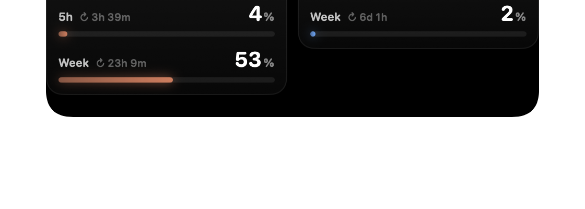

# Notch Limits

Your Claude Code and Codex subscription limits, hidden in the MacBook notch. Hover over the notch and it grows into a panel with every rate-limit window, how much of it you have used and when it resets. Move the cursor away and it melts back into the notch.



## What it shows

- **Claude Code**: the 5-hour window, the weekly window and, when your plan has them, the Opus/Sonnet weekly windows. The plan (Pro, Max 5x, Max 20x) comes from the local credentials.
- **Codex**: the windows the ChatGPT backend reports (5h and weekly), plus the plan.

A provider you are not signed in to on this Mac is simply not shown. Data refreshes every minute and every time you open the panel. If a request fails, the last known numbers stay on screen, dimmed, with the reason.

## Where the data comes from

Nothing to configure. The app reuses the logins the CLIs already keep:

| Provider | Credentials | Endpoint |
|---|---|---|
| Claude Code | Keychain item `Claude Code-credentials`, read through `/usr/bin/security` | `GET https://api.anthropic.com/api/oauth/usage` |
| Codex | `~/.codex/auth.json` (or `$CODEX_HOME/auth.json`) | `GET https://chatgpt.com/backend-api/wham/usage` |

The app is read-only: it never refreshes tokens. A refresh would rotate the refresh token and log the CLI out. When an access token expires, the card says so, and the next time you use `claude` or `codex` it is renewed and the panel picks it up.

Both endpoints are undocumented internals of the official clients and may change without notice.

## Install

Requires macOS 14+ on Apple Silicon, and Xcode or the Command Line Tools (Swift 6).

```bash
git clone https://github.com/isachivka/notch-limits && cd notch-limits
make install   # builds, copies to ~/Applications, launches
```

On first launch the app registers itself to start at login. Right-click the open panel for **Refresh**, **Launch at Login** and **Quit**.

On a Mac without a notch the panel opens from the middle of the menu bar.

## Development

```bash
make test   # parser and formatting tests
make run    # debug build, panel pinned open
```

`NOTCH_LIMITS_PINNED=1` keeps the panel open, which helps with UI work and screenshots.

## License

MIT
